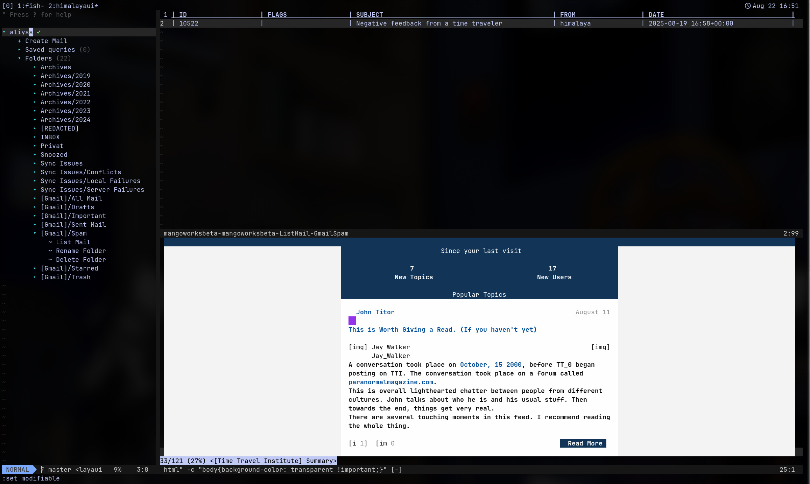

<div align="center">
    
    <h1>📫 vim-himalaya-ui</h1>
    <p>
        <strong>Simple Vim UI</strong> for <a href="https://github.com/pimalaya/himalaya">Himalaya CLI</a>
    </p>
    <p>
        
        
        <a href="http://discord.gg/zAypMTH">
            
        </a>
    </p>
</div>


Tested on Linux and Neovim.

Features:
* Navigate through multiple accounts and it's folders and emails

<div align="center">
    
</div>

## Disclaimer
The idea is to have a similar interface to [vim-dadbod-ui](https://github.com/kristijanhusak/vim-dadbod-ui), but for email.
Which is why I decided to fork it and modify it to the needs of himalaya.
This is a work in progress and it's not ready for use. Pull requests are extremely welcome.

This is my first vim plugin, so I'm learning as I go.

## Installation

Install and configure [Himalaya CLI](https://github.com/pimalaya/himalaya) first. This is not yet done via the UI (see the Roadmap). Then install this plugin using your favorite plugin manager. I have no clue if the following works. Please open an issue if it works or doesn't so I can remove this line. I use a different setup anyways (works on my machine).


### Using [packer](https://github.com/wbthomason/packer.nvim)

```lua
use "https://github.com/aliyss/vim-himalaya-ui"
```

```vim
:PackerSync
```

### Using [vim-plug](https://github.com/junegunn/vim-plug)

```vim
Plug 'https://github.com/aliyss/vim-himalaya-ui'
```

```vim
:PlugInstall
```

### Using [lazy.nvim](https://github.com/folke/lazy.nvim)

```lua
return {
    "aliyss/vim-himalaya-ui",
    cmd = {
        "HIMALAYAUI",
        "HIMALAYAUIToggle"
    },
    init = function()
        -- Your HIMALAYAUI configuration
    end,
}
```

## Usage
After configuring your mail account and installing this repo, run `:HIMALAYAUI` to open the UI.

## Actions

### Drawer

#### Account Actions
- [x] Create a new email
- [x] List folders in an account
- [x] List emails in a folder

### List

#### List Actions
- [x] Navigate Next & Previous Pages (Enter, n, p)
- [x] Read an email in the list view (Enter)
- [x] Refresh list of emails (r)

#### Email Actions
- [x] Reply to an email in the list view (mr)
- [x] Reply All to an email in the list view (mR)
- [x] Forward an email in the list view (mf)
- [x] Move an email in the list view (mm)
- [x] Copy an email in the list view (mc)
- [x] Download an email's attachments in the list view (ma)
- [x] Delete an email in the list view (md)

#### Multiple Email Actions
- [x] Move multiple emails in the list view (Visual mode + m)
- [x] Copy multiple emails in the list view (Visual mode + c)
- [x] Download multiple email's attachments in the list view (Visual mode + a)
- [x] Delete multiple emails in the list view (Visual mode + d)

### Email
- [x] Send/Save email in the mail create/reply/forward view (<BufWrite>) 
- [x] Discard email in the mail create/reply/forward view (<BufDelete>) 
- [x] Reply to the email in the mail view (r)
- [x] Reply All to the email in the mail view (R)
- [x] Forward the email in the mail view (f)
- [x] Move the email in the mail view (m)
- [x] Copy the email in the mail view (c)
- [x] Download the email's attachments in the mail view (a)
- [x] Delete the email in the mail view (d)
- [ ] Add attachment to the email in the mail view

## Additional Features

### Render Email HTML
When viewing an email, you can toggle between the text and HTML view by pressing `h`. This however requires you to have a terminal eml/html viewer installed.
You can set any browser of your choice and configure it like so:
```vim
let g:himalaya_ui_eml_converter = get(g:, 'himalaya_ui_html_viewer', 'mhonarc')
let g:himalaya_ui_eml_converter_args = get(g:, 'himalaya_ui_eml_converter_args', '-single')
let g:himalaya_ui_html_viewer = get(g:, 'himalaya_ui_html_viewer', 'cha')
let g:himalaya_ui_html_viewer_args = get(g:, 'himalaya_ui_html_viewer_args', '--type "text/html" -c "body{background-color: transparent !important;}"')
```

As you can see, I use `mhonarc` to convert the email to HTML and `chawan` to view it in the terminal. You can use any other tools of your choice.
Make sure to install them first though.

## Future

Fix multiple issues and implement more features.

### Roadmap

#### Mail List View (aka $ list mails)
Uses the current window where in dadbod you write the query, but instead lists all the emails.

_Actions (based on keybindings and hovered_over):_
- Open externally...
- Move to... (Telescope integration?)
- Allow overriding the default keybindings

#### Mail Display View
Displays Mail as text. Toggable to HTML view which shows raw html.

_Actions:_
- same as in List View
- (when hovered_on Thread expand...)

#### Mail Create View (aka $ create mail)
Pre-filled based on context. Should actually already work easily as himalaya provides most of this.

_Actions_
- Better Save and Discard
- Add Attachment
- Discard

--- 

Afaik that should be all of the main stuff.

---

_Hard stuff not provided by Himalaya:_
- Images maybe with sixel. No clue. I actually don't mind reading Email in text only.

